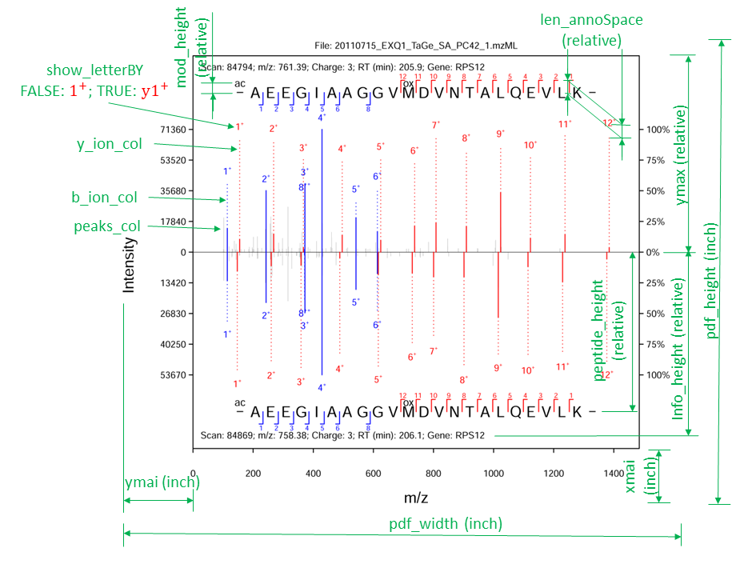

```{r setup, include = FALSE}
knitr::opts_chunk$set(
  collapse = TRUE,
  comment = "#>"
)
```

The package mms2plot visualizes multiple tandem mass spectrometry (MS2s) for modificated and/or unmodified peptides identified from the same raw MS files, annotated by peptide identification algorithms. It will output a mirror-style plot for two PSMs and a multiple-parallal plot for more than two PSMs. Based on these plots, users can check and compare these matches. The output is set in PDF format and the output file width is recommended as 3.35 inch (single column) or 7 inch (double column). 

The input files for mms2plot are referred to as two Maxquant parameter files (i.e. parameters.xml and mqpar.xml) and one maxquant output file (msms.txt). The input/output files of other search engines than Maxquant are easily converted to the maxquant styles and as the input files for mms2plot. 
             
## Settings of the output plot
```{r pressure, echo=FALSE, fig.cap="", out.width = '100%'}

```

Users can change the output plot by adjusting the input parameters in the mms2plot function. The meanings of these parameters are illustrated in the above image. Some of the settings are measured in inch and others are set relative to 1.


